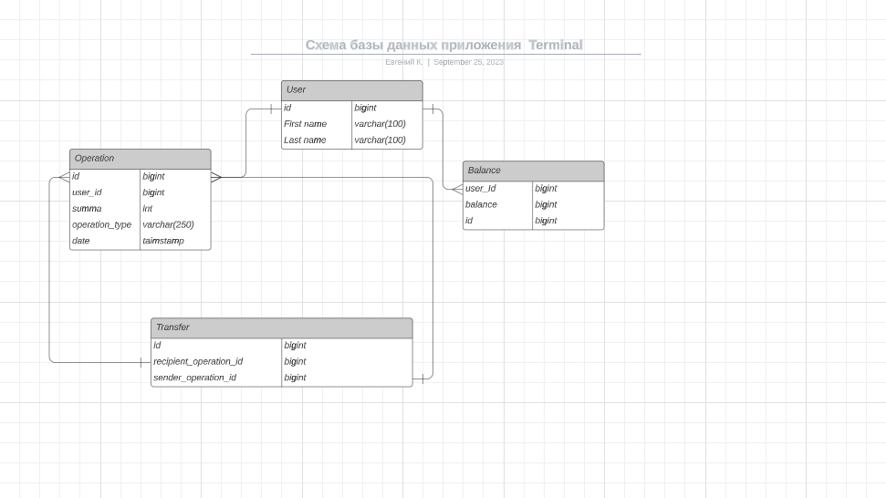

# ___Terminal___

Финальный проект курса Java.

### ___Архитектура___
Сервис предназначен для работы с Интернет-банком и представляет собой REST API.
___
### ___База данных___
Используется PostgreSQL
##### Схема базы данных:


___
### ___Функционал сервиса___
```
GET /balance/get - получение актуального баланса пользователя.
PUT /balance/put - пополнение баланса пользователя.
PUT /balance/take - снятие заданной суммы с баланса пользователя.
GET /operation/getList - получение списка операций для заднного пользователя в заданный промежуток времени.
PUT /balance/transfer - перевод денежныхпо указанным параметрам.
```
___
 
Produced by Joker)) axaxaxaxaxaxaxxa


                                                                              

